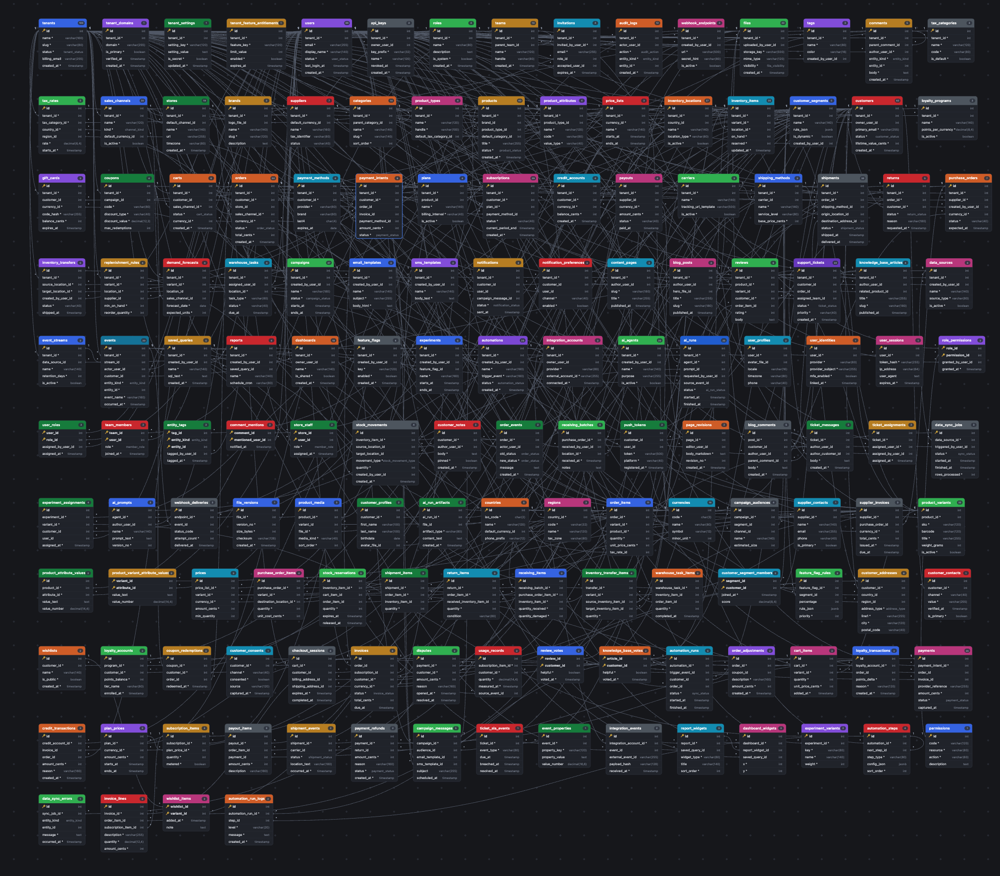
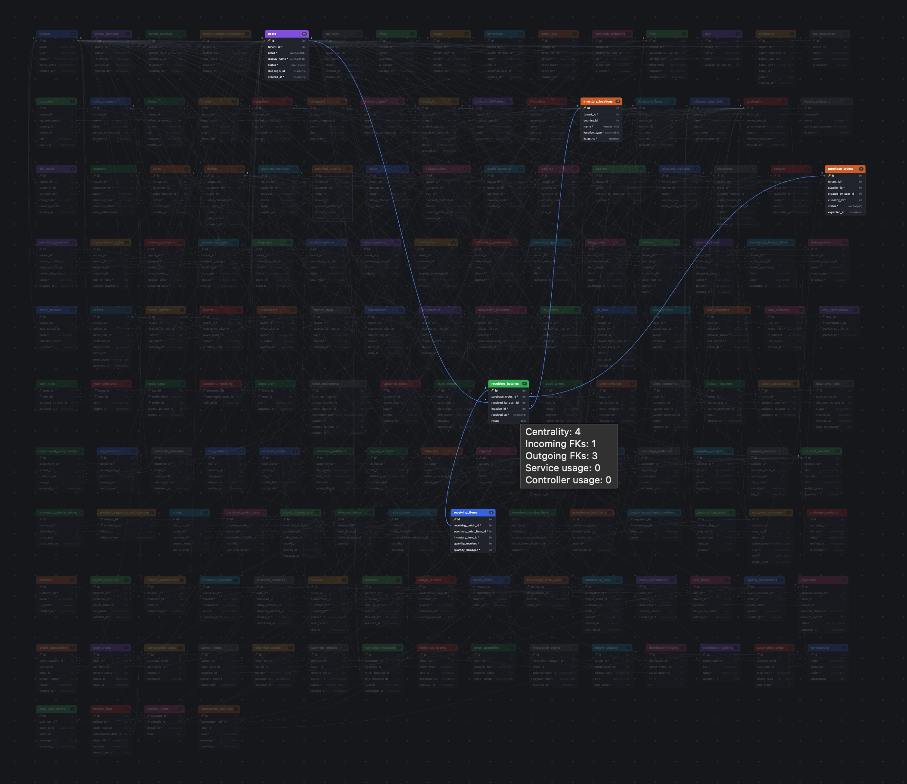
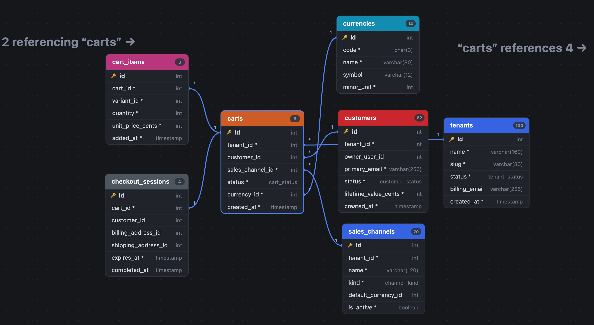

# DBVisualizer

DBVisualizer is a browser-based database schema visualizer for DBML. It is designed for exploring large, relationship-heavy schemas without needing a backend service, build step, or external database connection.

The app is especially useful when a schema is too large to understand from raw DBML alone. It gives you a full-canvas overview, lets you inspect relationships in place, and can focus on a single table so the important connections stand out from the noise.

## What it does

DBVisualizer turns DBML into an interactive diagram. You can paste or edit schema definitions, auto-arrange tables, zoom around the canvas, focus on a table, inspect incoming and outgoing relationships, and export the result as SVG or PNG.

The included showcase schema contains more than 150 tables and hundreds of relationships. It is intentionally dense so the visualizer can demonstrate how it handles real-world database complexity.

## Screenshots

### Full schema overview

The sample schema starts as a large, cluttered database map. This view is useful for understanding the overall size of the system and spotting major clusters such as identity, catalog, orders, fulfillment, support, analytics, and automation.



### Relationship inspection inside a cluttered schema

When a table or relationship is inspected, the diagram keeps the full context visible while highlighting the relevant paths. This makes it easier to understand how one part of the database connects to the rest without losing sight of the larger system.



### Focused carts table view

The focused table view isolates a table and its immediate relationships. In this example, the `carts` table is shown with the tables that reference it and the tables it references, making the checkout flow much easier to reason about.



## Main features

- Interactive DBML editor with live parsing.
- SVG-based schema diagram with pan, zoom, drag, and fit controls.
- Auto Layout for arranging tables automatically.
- Table focus mode for isolating incoming and outgoing relationships.
- Hover and relationship highlighting for dense schemas.
- Cardinality labels on relationship edges.
- Primary key, required field, enum, and column type rendering.
- Search box for jumping directly to a table.
- Export to SVG or PNG.
- Persistent editor state and table positions using browser storage.
- Built-in large sample schema loaded from `schema.dbml`.
- Separate SQL data viewer for browsing table data from MySQL or MariaDB dumps.

## Included sample schema

The Sample button loads `schema.dbml`, a large showcase schema built around a multi-tenant commerce and operations platform. It includes identity, catalog, inventory, checkout, orders, payments, fulfillment, procurement, marketing, support, analytics, integrations, automation, and AI operations.

The schema currently includes:

- 153 tables
- 370 relationships
- 23 enums
- 7 table groups

The sample is meant to be large enough to expose visual clutter first, then show how the app helps reduce that clutter through relationship inspection and focus mode.

## How to use

Open `index.html` through a local web server or a hosted static site.

Using a local server is recommended because the Sample button fetches `schema.dbml`. Opening the file directly with `file://` may cause the browser to block that request.

A simple local server is enough:

```bash
python3 -m http.server 8080
```

Then open:

```text
http://localhost:8080
```

From there:

1. Click Sample to load the showcase schema.
2. Click Auto Layout if you want to rearrange the diagram again.
3. Use the search box to find a table by name.
4. Click a table to focus on its direct relationships.
5. Press Escape or double-click the background to return to the full schema.
6. Export the diagram as SVG or PNG when needed.

## Data viewer

The project also includes a table data viewer at `data-viewer.html`. It is separate from the DBML diagram and is intended for browsing SQL dump data.

The data viewer can parse MySQL or MariaDB-style dumps with `CREATE TABLE` and `INSERT INTO` statements. It supports table navigation, filtering, sorting, pagination, foreign-key navigation, cached imports, and CSV export.

## Supported DBML features

The parser is intentionally practical rather than exhaustive. It supports the DBML features used by the visualizer:

- `Project` blocks
- `Table` definitions
- Schema-qualified table names
- Table aliases
- Table settings such as `color`, `service_usage`, and `controller_usage`
- Column settings such as `pk`, `not null`, `unique`, `increment`, `default`, and `note`
- Inline references
- Standalone `Ref` statements
- One-to-one, one-to-many, and many-to-many relationship operators
- Composite reference syntax
- `Enum` definitions
- `TableGroup` definitions
- Single-line and multi-line table notes

Unsupported or unknown settings are ignored where possible so the editor remains forgiving while working with large schemas.

## Project structure

```text
.
├── index.html              # DBML visualizer
├── data-viewer.html        # SQL dump data viewer
├── schema.dbml             # Large built-in sample schema
├── sampleimages/           # README screenshots
├── css/
│   ├── style.css           # Visualizer styles
│   └── data-viewer.css     # Data viewer styles
└── js/
    ├── main.js             # Visualizer app wiring
    ├── parser.js           # DBML parser
    ├── diagram.js          # SVG diagram renderer
    ├── layout.js           # Auto layout and focus layout
    ├── data-viewer.js      # Data viewer app wiring
    └── sql-data-parser.js  # SQL dump parser
```

## Design notes

DBVisualizer is built as a static frontend application. There is no server-side processing and no database connection. Schema text and table positions are stored locally in the browser.

The diagram is rendered with SVG so it can be exported cleanly. For smaller and medium schemas, Auto Layout uses a force-directed approach. For very large schemas, it switches to a faster connectivity-aware grid layout to keep the app responsive.

The visualizer is intentionally optimized for exploration rather than database administration. It helps developers, reviewers, and product teams understand schema shape, ownership, and relationship density before going deeper into implementation details.

## Browser support

Use a modern desktop browser for the best experience. Large schemas are easier to inspect with a wide screen, mouse or trackpad, and hardware-accelerated SVG rendering.

## License

Add your project license here if this repository is intended to be published or reused by others.
